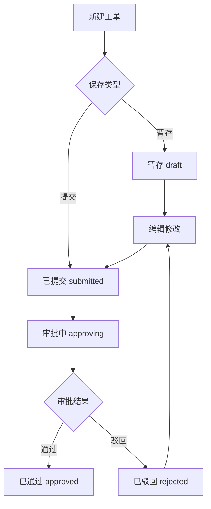

# 液态玻璃后台管理系统 - 产品需求文档（PRD）

## 1. 产品概述

一套面向数据运营人员的 PC + 移动端自适应标准后台管理系统，覆盖"工作台首页、我的发布、我的申请"三大业务域。系统以"工单流转 + 审批流程"为核心，支持暂存/驳回工单的二次修改与已提交工单的只读查看，统一采用液态玻璃（Liquid Glass）视觉风格，主色调为深蓝 + 紫色 + 黑色，所有页面共享一套标准 CSS/JS 资源，形成统一的设计语言与交互规范。

- **目标用户**：数据目录/产品/需求发布人员、场景申请人员
- **核心价值**：在一个统一、克制、高级的玻璃质感界面中完成发布与申请的全流程管理

---

## 2. 核心功能

### 2.1 用户角色

| 角色 | 注册方式 | 核心权限 |
|------|----------|----------|
| 数据运营人员 | 系统分配账号 | 发布数据目录/产品/需求、申请场景、查看与修改自有工单 |
| 审批人 | 系统分配账号 | 审批工单（本系统仅做流程展示，不实现真实审批动作） |

### 2.2 功能模块

1. **工作台首页**：欢迎区、核心统计卡片（发布总数/申请总数/待处理/已通过）、最近工单列表、快捷入口
2. **我的发布**
   - 数据目录发布：列表 + 详情
   - 产品发布：列表 + 详情
   - 需求发布：列表 + 详情
3. **我的申请**
   - 场景申请：列表 + 详情
4. **详情页通用能力**：基础信息表单 + 右侧审批流程时间线 + 底部操作按钮（按工单状态切换）

### 2.3 页面详情

| 页面名称 | 模块名称 | 功能描述 |
|----------|----------|----------|
| 工作台首页 | 欢迎与统计 | 4 张统计卡片（带趋势/图标）、最近 5 条工单、快捷发布入口 |
| 工作台首页 | 快捷入口 | 一键跳转各发布/申请列表 |
| 发布列表（目录/产品/需求） | 筛选与表格 | 关键字搜索、状态/时间筛选、分页表格、行内查看/编辑按钮 |
| 发布详情 | 表单区 | 名称、分类、描述、附件等字段（按状态可编辑或只读） |
| 发布详情 | 审批流程 | 右侧时间线展示提交/审批/驳回节点 |
| 申请列表（场景） | 筛选与表格 | 同上，字段为场景相关 |
| 申请详情 | 表单区 | 场景名称、用途、范围等字段 |
| 申请详情 | 审批流程 | 右侧时间线 |
| 全局 | 顶栏 | Logo、搜索、通知、用户头像 |
| 全局 | 侧边栏 | 折叠菜单（工作台/我的发布[3 子项]/我的申请[1 子项]） |

---

## 3. 核心流程

### 3.1 工单生命周期

用户创建工单 → 暂存（可继续编辑）→ 提交（锁定只读）→ 审批中（只读）→ 通过（只读）/ 驳回（可再次编辑并提交）。

### 3.2 状态与可编辑性规则

| 工单状态 | 可查看 | 可编辑 | 可提交 |
|----------|--------|--------|--------|
| 暂存（draft） | ✅ | ✅ | ✅ |
| 驳回（rejected） | ✅ | ✅ | ✅ |
| 已提交（submitted） | ✅ | ❌ | ❌ |
| 审批中（approving） | ✅ | ❌ | ❌ |
| 已通过（approved） | ✅ | ❌ | ❌ |

### 3.3 流程图

---

## 4. 用户界面设计

### 4.1 设计风格

- **风格**：液态玻璃（Liquid Glass / Glassmorphism），半透明卡片 + 背景模糊 + 微光描边 + 流动渐变背景
- **主色调**：
  - 深蓝 `#0B1E3F`（主背景基底）
  - 紫色 `#7C3AED / #A855F7`（强调与渐变）
  - 黑色 `#05070F`（深色面板与文字底）
  - 辅助：青蓝 `#22D3EE` 用于数据高亮
- **按钮风格**：玻璃质感圆角按钮，主按钮紫蓝渐变 + 内发光，次按钮半透明描边
- **字体**：标题使用 `Sora`（几何感），正文使用 `Noto Sans SC`（中文适配）
- **布局**：左侧固定折叠侧边栏 + 顶栏 + 卡片式内容区，桌面优先，移动端折叠为抽屉菜单
- **图标**：线性图标（Lucide 风格 SVG 内联）
- **动效**：卡片入场 stagger、玻璃 hover 抬升、背景流动渐变、状态徽章微脉冲

### 4.2 页面设计概览

| 页面名称 | 模块名称 | UI 元素 |
|----------|----------|---------|
| 工作台首页 | 统计卡片 | 玻璃卡片 + 图标 + 数字 + 趋势条 + 入场动画 |
| 工作台首页 | 最近工单 | 半透明表格 + 状态徽章 + 行 hover |
| 列表页 | 筛选条 | 玻璃搜索框 + 下拉筛选 + 日期范围 |
| 列表页 | 数据表格 | 斑马纹玻璃行 + 操作按钮组 + 分页 |
| 详情页 | 表单 | 玻璃分组卡片 + 浮动标签输入框 |
| 详情页 | 审批流程 | 右侧抽屉/侧栏时间线 + 节点状态色点 |

### 4.3 响应式

- **桌面优先**：≥1200px 三栏（侧边栏 + 内容 + 可能的右侧流程常驻）
- **平板**：768–1199px 侧边栏可折叠为图标条，详情页审批流程改为抽屉
- **移动端**：<768px 侧边栏改为顶部抽屉菜单，表格转为卡片列表，统计卡片单列堆叠
- **触控优化**：按钮最小命中区 44px，关闭 hover 依赖，支持滑动手势

### 4.4 共用标准

- 所有颜色、圆角、阴影、间距、字号、动效时长通过 CSS 变量统一管理
- 所有按钮、卡片、表单、表格、徽章、分页、抽屉、时间线抽离为可复用组件类
- 所有页面共用 `standard.css`、`components.css`、`app.js`、`components.js`
- 交互（弹窗、抽屉、表单校验、筛选）由共用 JS 工具统一驱动
