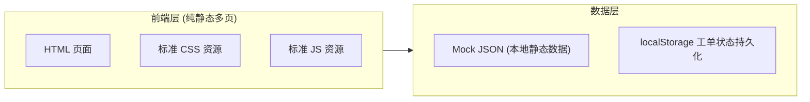
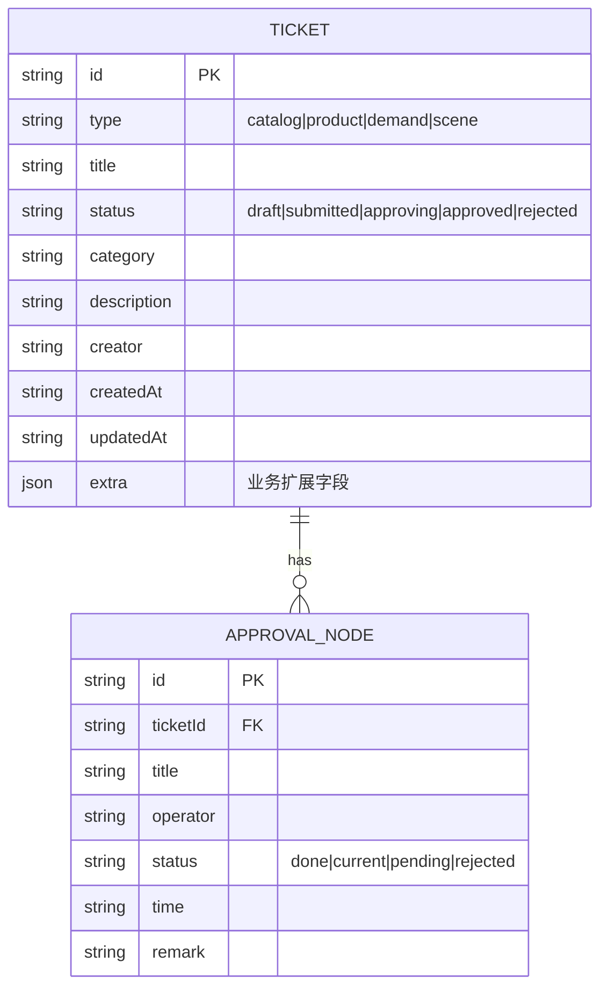

# 液态玻璃后台管理系统 - 技术架构文档

## 1. 架构设计



采用**纯静态多页应用（MPA）**架构：每个功能页面为独立 HTML，共用一套标准 CSS 与 JS 资源。数据使用本地 Mock JSON，工单状态通过 localStorage 持久化以演示"暂存/驳回可编辑、已提交只读"的流转。

### 选型理由
- 用户明确要求"页面引用一套标准 CSS 以及 JS 等文件"，MPA + 共享资源最贴合
- 无需构建工具，部署即用，便于二次集成到任意后端
- 共用 `components.css` / `components.js` 保证"一套标准"

---

## 2. 技术说明

- **前端**：原生 HTML5 + CSS3 + 原生 JavaScript (ES6+)
- **构建工具**：无（直接静态资源，可选 Vite 用于本地预览）
- **后端**：无（Mock 数据 + localStorage）
- **图标**：内联 SVG（Lucide 风格线性图标）
- **字体**：Google Fonts `Sora` + `Noto Sans SC`
- **关键 CSS 特性**：CSS 变量、`backdrop-filter`、CSS Grid/Flexbox、`clamp()` 响应式排版
- **关键 JS 特性**：原生模块、自定义事件、localStorage 封装、组件化渲染函数

---

## 3. 目录结构

```
/workspace
├── index.html                      # 工作台首页
├── pages/
│   ├── publish/
│   │   ├── catalog-list.html       # 数据目录发布列表
│   │   ├── catalog-detail.html     # 数据目录发布详情
│   │   ├── product-list.html       # 产品发布列表
│   │   ├── product-detail.html     # 产品发布详情
│   │   ├── demand-list.html        # 需求发布列表
│   │   └── demand-detail.html      # 需求发布详情
│   └── apply/
│       ├── scene-list.html         # 场景申请列表
│       └── scene-detail.html       # 场景申请详情
├── assets/
│   ├── css/
│   │   ├── standard.css            # 标准：变量/重置/排版/背景
│   │   ├── components.css          # 标准：按钮/卡片/表单/表格/徽章/分页/抽屉/时间线
│   │   └── layout.css              # 标准：侧边栏/顶栏/响应式栅格
│   ├── js/
│   │   ├── app.js                  # 标准：全局初始化/侧边栏/主题/工具函数
│   │   ├── components.js           # 标准：表格/分页/抽屉/时间线/徽章渲染
│   │   └── data.js                 # 标准：Mock 数据与状态管理
│   └── icons/                      # SVG 图标（可选，优先内联）
└── .trae/documents/
    ├── prd.md
    └── tech.md
```

---

## 4. 路由定义

| 路径 | 用途 |
|------|------|
| `/index.html` | 工作台首页：统计卡片 + 最近工单 + 快捷入口 |
| `/pages/publish/catalog-list.html` | 数据目录发布列表 |
| `/pages/publish/catalog-detail.html?id=xxx` | 数据目录发布详情（含审批流程） |
| `/pages/publish/product-list.html` | 产品发布列表 |
| `/pages/publish/product-detail.html?id=xxx` | 产品发布详情 |
| `/pages/publish/demand-list.html` | 需求发布列表 |
| `/pages/publish/demand-detail.html?id=xxx` | 需求发布详情 |
| `/pages/apply/scene-list.html` | 场景申请列表 |
| `/pages/apply/scene-detail.html?id=xxx` | 场景申请详情 |

详情页通过 URL `?id=` 读取工单，状态由 `data.js` 统一管理（localStorage 持久化）。

---

## 5. 数据模型

### 5.1 工单（Ticket）统一模型



### 5.2 状态枚举

| status | 名称 | 颜色 | 可编辑 |
|--------|------|------|--------|
| draft | 暂存 | 灰蓝 | ✅ |
| submitted | 已提交 | 紫 | ❌ |
| approving | 审批中 | 青 | ❌ |
| approved | 已通过 | 绿 | ❌ |
| rejected | 已驳回 | 红 | ✅ |

---

## 6. 共用标准资源说明

### 6.1 `standard.css`
- CSS 变量：色彩 / 圆角 / 阴影 / 间距 / 字号 / 动效时长 / 玻璃模糊度
- 重置样式、字体加载、流动渐变背景、滚动条美化、选中态

### 6.2 `components.css`
- `.btn` / `.btn-primary` / `.btn-ghost` / `.btn-danger`
- `.glass-card` / `.stat-card` / `.panel`
- `.field` / `.input` / `.select` / `.textarea` / `.label-float`
- `.table` / `.table-row` / `.table-actions`
- `.badge` / `.badge--draft` 等
- `.pager`
- `.drawer` / `.drawer-mask`
- `.timeline` / `.timeline-node`
- `.toast`

### 6.3 `app.js`
- 侧边栏折叠 / 移动端抽屉切换
- 顶栏交互
- 通用工具：`qs`、`formatDate`、`debounce`
- 路由高亮

### 6.4 `components.js`
- `renderTable(container, { columns, rows, actions })`
- `renderPager(container, { total, page, pageSize, onChange })`
- `renderTimeline(container, nodes)`
- `renderBadge(status)`
- `openDrawer(content)` / `closeDrawer()`
- `toast(msg, type)`
- `bindFilters(form, onFilter)`

### 6.5 `data.js`
- `getTickets(type, filters)` / `getTicket(id)`
- `saveTicket(ticket)` / `submitTicket(id)`
- localStorage 持久化与初始化种子数据
- 状态机校验（draft/rejected 可编辑）

---

## 7. 响应式断点

| 断点 | 范围 | 行为 |
|------|------|------|
| `xl` | ≥1280px | 侧边栏展开 240px，详情页右侧流程常驻 |
| `lg` | 1024–1279px | 侧边栏图标条 72px，流程常驻 |
| `md` | 768–1023px | 侧边栏抽屉，流程改抽屉 |
| `sm` | <768px | 顶部抽屉菜单，表格转卡片，统计单列 |

---

## 8. 液态玻璃实现要点

- `backdrop-filter: blur(20px) saturate(140%)` 实现毛玻璃
- 卡片背景 `rgba(255,255,255,0.06)` + 1px 渐变描边
- 顶层背景使用多层径向渐变（深蓝→紫→黑）+ 缓慢流动动画
- 按钮内发光 `box-shadow: inset 0 1px 0 rgba(255,255,255,.2), 0 8px 24px rgba(124,58,237,.35)`
- 文字层级：主 `rgba(255,255,255,.95)` / 次 `.6` / 弱 `.4`
- 状态色点带呼吸动画
